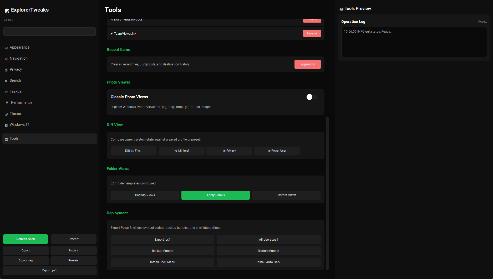

# ExplorerTweaks v1.2.0

<div align="center">


**A premium utility for managing Windows File Explorer settings with real-time preview**

*Toggle 50+ Explorer settings with instant visual feedback in a modern dark-themed interface*



</div>

---

## ✨ Features

- **👁️ Live Preview** - See changes in real-time before applying! A mock File Explorer updates instantly as you toggle settings
- **🎨 Modern Dark Theme** - Spotify/Discord-inspired interface that's easy on the eyes
- **🔄 One-Click Toggles** - Simple switches for every setting with instant feedback
- **📖 Detailed Explanations** - Every setting includes a clear description of what it does
- **🪟 OS-Aware** - Automatically detects Windows 10/11 and shows only compatible settings
- **📦 Portable** - Single executable, no installation required
- **💾 Export/Import** - Save and restore your configuration
- **⚡ No Bloat** - Clean, focused utility that does one thing well

## 🎬 Live Preview

The right panel shows a mock File Explorer that updates **instantly** as you toggle settings:

- **File extensions** - See ".txt", ".exe" appear/disappear on file names
- **Hidden files** - Watch hidden items fade in/out
- **System files** - See protected files appear
- **Checkboxes** - Selection boxes appear next to items
- **Compact view** - Row spacing changes in real-time
- **Status bar** - Watch it show/hide
- **Title bar path** - See full path vs folder name
- **Navigation pane** - Watch items like Gallery, OneDrive appear/disappear
- **Encrypted/Compressed colors** - Files change to green/blue

## 📸 Screenshots

<div align="center">

| Main Interface | Categories |
|:---:|:---:|
|  |  |

</div>

## 🚀 Quick Start

### Option 1: Download Pre-built Executable

1. Go to [Releases](../../releases)
2. Download `ExplorerTweaks.exe`
3. Run the executable (no installation needed)

### Option 2: Run from Source

```powershell
# Clone the repository
git clone https://github.com/yourusername/ExplorerTweaks.git
cd ExplorerTweaks

# Install dependencies
pip install -r requirements.txt

# Run the application
python explorer_tweaks.py
```

### Option 3: Build Your Own Executable

```powershell
# Clone and install
git clone https://github.com/yourusername/ExplorerTweaks.git
cd ExplorerTweaks
pip install -r requirements.txt

# Build executable
build.bat
```

The executable will be created in the `dist` folder.

## 📋 Available Settings

### Appearance
| Setting | Description |
|---------|-------------|
| Show File Extensions | Display .txt, .exe, etc. after file names |
| Show Hidden Files | Display files with hidden attribute |
| Show System Files | Display protected operating system files |
| Compact View | Reduce spacing between items (Win11) |
| Show Thumbnails | Display preview images for files |
| Status Bar | Show item count at bottom of window |
| Full Path in Title | Show complete path in window title |

### Navigation
| Setting | Description |
|---------|-------------|
| Open to This PC | Start Explorer at This PC instead of Quick Access |
| Expand to Folder | Auto-expand tree to current location |
| Separate Process | Run each window independently |
| Restore at Logon | Reopen previous Explorer windows |

### Privacy
| Setting | Description |
|---------|-------------|
| Recent Files | Show/hide recent files in Quick Access |
| Frequent Folders | Show/hide frequently used folders |
| Track Documents | Enable/disable document tracking |
| Sync Notifications | OneDrive promotional notifications |

### Search
| Setting | Description |
|---------|-------------|
| Bing Web Search | Include web results in Start search |
| Cortana | Enable/disable Cortana integration |
| Search History | Show/hide your search history |

### Taskbar
| Setting | Description |
|---------|-------------|
| Task View Button | Show/hide Task View button |
| Widgets Button | Show/hide Widgets (Win11) |
| Search Box | Hidden / Icon / Full Box |
| Taskbar Alignment | Center or Left (Win11) |

### Windows 11 Specific
| Setting | Description |
|---------|-------------|
| Classic Context Menu | Restore full right-click menu |
| Gallery | Show/hide Gallery in nav pane |
| Snap Layouts | Hover maximize for layouts |

### Performance
| Setting | Description |
|---------|-------------|
| Taskbar Animations | Enable/disable animations |
| Aero Peek | Desktop preview on hover |
| Thumbnail Cache | Cache previews to disk |
| Network Thumbs.db | Create cache on network |

### Theme
| Setting | Description |
|---------|-------------|
| Dark Mode (System) | Taskbar, Start menu |
| Dark Mode (Apps) | Application windows |

## 🔧 Technical Details

### Registry Locations

ExplorerTweaks modifies settings in these registry locations:

```
HKCU\Software\Microsoft\Windows\CurrentVersion\Explorer\Advanced
HKCU\Software\Microsoft\Windows\CurrentVersion\Explorer
HKCU\Software\Microsoft\Windows\CurrentVersion\Explorer\CabinetState
HKCU\Software\Microsoft\Windows\CurrentVersion\Search
HKCU\Software\Microsoft\Windows\CurrentVersion\Themes\Personalize
HKCU\Software\Classes\CLSID\{...}  (for nav pane items)
```

### OS Compatibility

| Feature | Windows 10 | Windows 11 |
|---------|:----------:|:----------:|
| Basic Explorer Settings | ✅ | ✅ |
| Classic Context Menu | ❌ | ✅ |
| Compact View | ❌ | ✅ |
| Gallery Control | ❌ | ✅ (23H2+) |
| Taskbar Alignment | ❌ | ✅ |
| Widgets Button | ❌ | ✅ |

### Requirements

- Windows 10 (1903+) or Windows 11
- No admin rights required for most settings
- Python 3.8+ (if running from source)

## 📁 Project Structure

```
ExplorerTweaks/
├── explorer_tweaks.py    # Main application
├── requirements.txt      # Python dependencies
├── build.bat            # Build script for exe
├── icon.ico             # Application icon
├── README.md            # This file
└── docs/
    └── screenshots/     # UI screenshots
```

## 🤝 Contributing

Contributions are welcome! Here's how you can help:

1. **Report bugs** - Open an issue with steps to reproduce
2. **Suggest features** - Open an issue with your idea
3. **Submit PRs** - Fork, make changes, submit pull request

### Adding New Settings

To add a new setting, add a `RegistrySetting` object to the `get_all_settings()` function:

```python
RegistrySetting(
    id="unique_id",
    name="Display Name",
    description="Clear explanation of what this does.",
    category="Category",
    subcategory="Subcategory",
    reg_path=r"Software\Microsoft\...",
    reg_name="ValueName",
    reg_type="DWORD",
    enable_value=1,
    disable_value=0,
    default_value=0,
    min_os=OSVersion.WINDOWS_11_21H2,  # Optional
)
```

## 📜 License

This project is licensed under the MIT License - see the [LICENSE](LICENSE) file for details.

## 🙏 Acknowledgments

- [CustomTkinter](https://github.com/TomSchimansky/CustomTkinter) - Modern UI framework
- [privacy.sexy](https://github.com/undergroundwires/privacy.sexy) - Registry research
- [WinUtil](https://github.com/ChrisTitusTech/winutil) - Registry research

## ⚠️ Disclaimer

This tool modifies Windows Registry settings. While all changes are reversible and the tool only modifies user-level settings (HKCU), please:

- **Create a system restore point** before making changes
- **Export your settings** before experimenting
- **Understand what each setting does** before toggling

The authors are not responsible for any issues that may arise from using this tool.

---

<div align="center">

**Made with ❤️ for the Windows community**

[Report Bug](../../issues) · [Request Feature](../../issues) · [Discussions](../../discussions)

</div>
