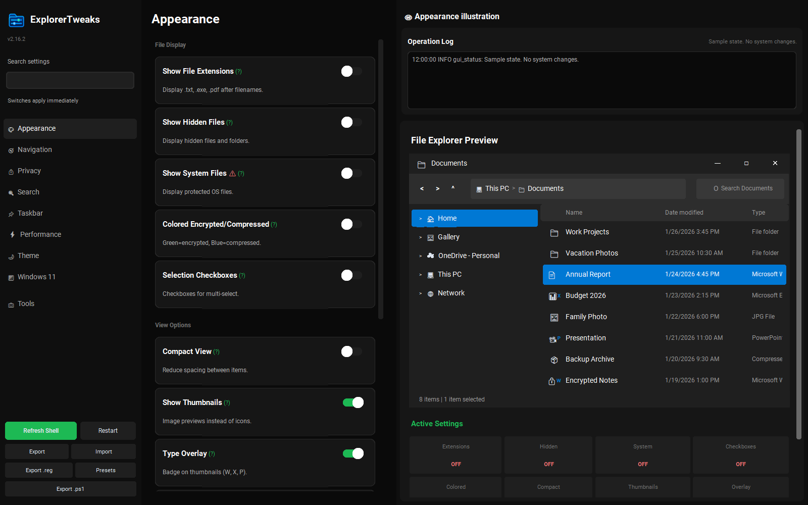
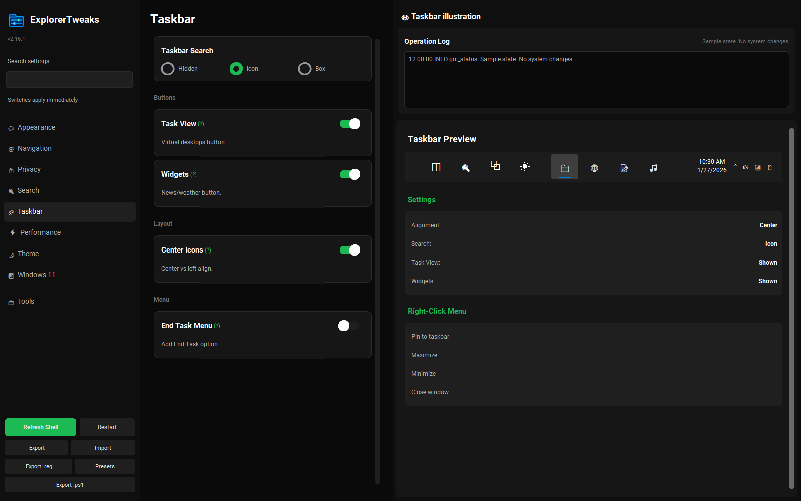
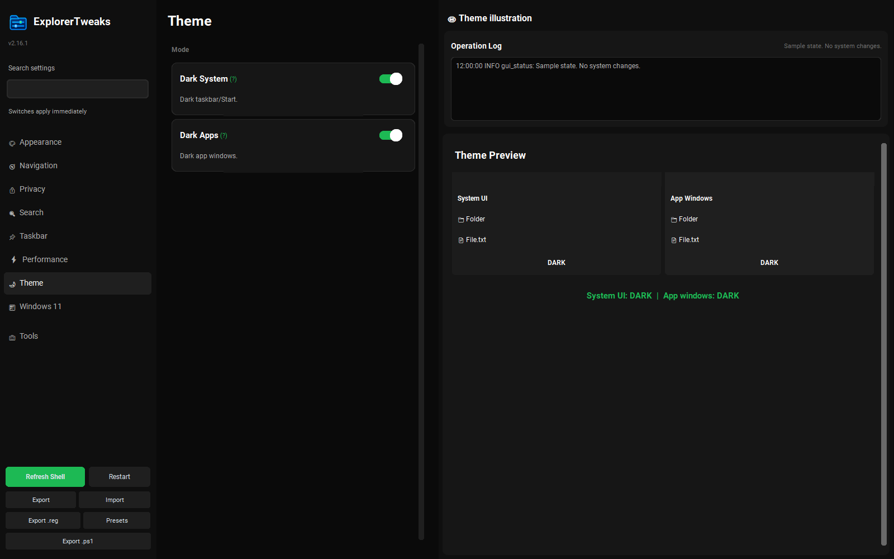

<p align="center">
  
</p>

# ExplorerTweaks v2.16.1


**Windows Explorer settings, in one place.**

Choose how files appear, adjust the taskbar, or save a setup to reuse on another PC. ExplorerTweaks pairs registry controls with an illustrated preview, so the options are easier to understand.

[Download the portable ZIP](https://github.com/SysAdminDoc/ExplorerTweaks/releases/download/v2.16.1/ExplorerTweaks-v2.16.1-win64.zip) · [All release files](https://github.com/SysAdminDoc/ExplorerTweaks/releases/tag/v2.16.1) · [Start safely](#start-safely)

No installer or Python is needed for the Windows executable. Most per-user settings don't need administrator access. Normal GUI switches apply immediately; the preview isn't a separate approval step.



## What you can do

| When you want to... | Start here |
| --- | --- |
| See file extensions, hidden files, or a fuller folder path | Appearance and Navigation group the relevant settings with explanations. |
| Adjust taskbar buttons and Windows theme preferences | Taskbar and Theme illustrate supported choices. |
| Reuse a preferred setup | Save a JSON profile, compare it with another setup, or export registry and PowerShell scripts. |
| Prepare a deployment | Export mapped policy settings or Intune remediation scripts. PSRemoting uses access you've already configured. |
| Recover from a change | Export a profile or create a targeted backup first. A bundle isn't a system restore point. |

The catalog contains 41 registry settings, plus separate tools for folder-view defaults and context-menu entries. Availability depends on the Windows build and existing policies. Policy-locked GUI switches show a warning without attempting a write. A successful registry write doesn't guarantee that every Windows release still honors the setting.

## See the controls

| Taskbar | Theme |
| --- | --- |
|  |  |

[Navigation view](assets/screenshots/02-navigation.png) · [Presets and tools](assets/screenshots/05-tools.png)

These are captures of the actual CustomTkinter app using a Windows 11 sample configuration on a private desktop. The file list and taskbar are built-in illustrations, not a replacement for File Explorer or a view of your files. Capture mode blocks system commands. The [capture record](assets/screenshots/capture-report.json) identifies its source files and images by SHA-256.

## Start safely

1. Download and extract the versioned ZIP. Keep its files together if you want the illustrated guide and original artwork available offline.
2. Compare the ZIP's SHA-256 with the checksum file from the same release.
3. Run `ExplorerTweaks.exe`. Export a JSON profile before changing settings. The Tools page also offers a targeted backup bundle.
4. Change one setting at a time. Some changes need a shell refresh or an Explorer restart.

The executable isn't Authenticode-signed because no code-signing certificate is configured. Windows may show a security warning. Review the source and checksum; don't disable security software to run it.

For a saved change plan instead of applying a preset:

```powershell
.\ExplorerTweaks.exe --preset "Power User" --dry-run --dry-run-report review.json
```

The report is written to the file you specify. The built-in Privacy preset changes selected Windows preferences; it isn't a guarantee of complete privacy.

### Backups and removal

Folder-view changes reset existing Explorer view bags. Use the built-in backup option before applying a folder-view preset. Profile exports and backup bundles cover their documented settings and files, not the whole computer. Review restore warnings.

If you installed Shell Menu or Auto Dark integrations, remove them from Tools before deleting the app. Deleting the executable doesn't undo registry changes. Restore a saved profile or backup separately.

## Run from source

Python 3.10 or newer is required by the pinned dependencies.

```powershell
git clone https://github.com/SysAdminDoc/ExplorerTweaks.git
cd ExplorerTweaks
python -m venv .venv
.\.venv\Scripts\python.exe -m pip install -r requirements.txt
.\.venv\Scripts\python.exe explorer_tweaks.py
```

For the commands below, use your environment's Python. The portable executable accepts the same arguments in place of `python explorer_tweaks.py`, but it's a windowed build and doesn't print into a terminal. Use Python for terminal output, or use the executable's file exports and `--dry-run-report`.

## CLI Usage

```powershell
python explorer_tweaks.py --list-presets
python explorer_tweaks.py --preset "Power User" --dry-run
python explorer_tweaks.py --preset "Power User" --dry-run --dry-run-report report.json
python explorer_tweaks.py --apply profile.json
python explorer_tweaks.py --apply profile.json --all-users
python explorer_tweaks.py --export settings.json
python explorer_tweaks.py --export settings.reg --format reg
python explorer_tweaks.py --export settings.ps1 --format ps1 --all-users
python explorer_tweaks.py --export settings-policy.ps1 --format ps1 --managed-policy
python explorer_tweaks.py --export-profile-ps1 profile.json deploy.ps1 --all-users
python explorer_tweaks.py --export-profile-ps1 profile.json deploy-policy.ps1 --managed-policy
python explorer_tweaks.py --export-intune-remediation profile.json .\intune-remediation
python explorer_tweaks.py --remote-apply profile.json --computer PC-01 --computer PC-02 --dry-run
python explorer_tweaks.py --backup ExplorerTweaks_backup.zip
python explorer_tweaks.py --restore ExplorerTweaks_backup.zip
python explorer_tweaks.py --folder-view-preview
python explorer_tweaks.py --folder-view-backup folder_views.zip
python explorer_tweaks.py --folder-view-apply details --folder-view-backup-before folder_views.zip
python explorer_tweaks.py --folder-view-restore folder_views.zip
python explorer_tweaks.py --context-menu-list
python explorer_tweaks.py --context-menu-inventory context_menu_inventory.json
python explorer_tweaks.py --context-menu-disable "HKCU|Software\Classes\Directory\shell\Example"
python explorer_tweaks.py --context-menu-export-pack context_menu_pack.json
python explorer_tweaks.py --context-menu-import-pack context_menu_pack.json --dry-run
python explorer_tweaks.py --install-context-menu
python explorer_tweaks.py --uninstall-context-menu
python explorer_tweaks.py --install-darkmode-auto-switch
python explorer_tweaks.py --install-darkmode-auto-switch --darkmode-lat 40.7128 --darkmode-lon -74.0060
python explorer_tweaks.py --uninstall-darkmode-auto-switch
python explorer_tweaks.py --wipe-recent
```

## Setting Categories

- Appearance: file extensions, hidden files, protected OS files, checkboxes, compact view, thumbnails, type overlays, status bar, title/address path display.
- Navigation: launch target, nav pane expansion, all folders, separate process, restore windows at logon, sharing wizard.
- Privacy: recent files, frequent folders, document/app tracking, OneDrive sync provider notifications, suggested app installs.
- Search: Bing web results, Cortana consent, search history, taskbar search mode.
- Taskbar: Task View, Widgets, centered icons, End Task menu.
- Performance: taskbar animations, Aero Peek, thumbnail cache, network `thumbs.db`, Snap Assist, Snap Layouts.
- Theme: app and system dark mode.
- Windows 11: Gallery and classic context menu.
- Tools: presets, Send To cleanup, recent-items wipe, Photo Viewer, profile diff, deployment, backup/restore, shell integration, auto dark mode.

## Deployment Notes

`--format ps1` exports the current machine state as a PowerShell script. By default it applies to the current user; pass `--all-users` to make the script target `HKU\.DEFAULT` and all loaded user SIDs unless the script is run with `-CurrentUserOnly`.

Pass `--managed-policy` with PowerShell exports to write mapped HKLM policy keys instead of preference keys. Settings without a declared policy/CSP equivalent are omitted and reported. `--export-intune-remediation PROFILE DIR` writes `ExplorerTweaks_detect.ps1` and `ExplorerTweaks_remediate.ps1` for Intune remediation packages.

`--remote-apply` uses PowerShell Remoting and assumes WinRM access is already configured for the target computers. It does not manage credentials or enable remoting.

The dark-mode auto-switch installs a per-user scheduled task named `\ExplorerTweaks\DarkModeAutoSwitch`. If Windows Location access is disabled, reinstall with `--darkmode-lat` and `--darkmode-lon`.

Folder-view defaults manage the current user's Explorer Shell Bags defaults. `--folder-view-apply` resets existing folder view bags, writes the selected preset for common folder templates, and should be paired with `--folder-view-backup-before` or the GUI's automatic backup.

Context-menu inventory scans common HKCU/HKLM File, Directory, Background, and Drive shell roots. Disable/enable operations only set or remove `LegacyDisable` on entries under those inventory roots. Action packs import only into approved HKCU shell roots. Action-pack `icon` values must use a Windows shell icon location such as `shell32.dll,1`, `%SystemRoot%\System32\imageres.dll,-102`, or a path to an `.ico` file; the target file is not required to exist during import.

## Registry Locations

ExplorerTweaks writes user-level registry settings under:

```text
HKCU\Software\Microsoft\Windows\CurrentVersion\Explorer\Advanced
HKCU\Software\Microsoft\Windows\CurrentVersion\Explorer
HKCU\Software\Microsoft\Windows\CurrentVersion\Explorer\CabinetState
HKCU\Software\Microsoft\Windows\CurrentVersion\Search
HKCU\Software\Microsoft\Windows\CurrentVersion\Themes\Personalize
HKCU\Software\Microsoft\Windows\DWM
HKCU\Software\Classes\CLSID\{86ca1aa0-34aa-4e8b-a509-50c905bae2a2}
HKCU\Software\Classes\Directory\shell
HKCU\Software\Classes\Directory\Background\shell
HKCU\Software\Classes\Drive\shell
HKCU\Software\Classes\DesktopBackground\Shell
```

Most settings do not require administrator rights. Multi-user mode can only touch user hives that are already loaded.

## Development

Use PowerShell 7 for the release build:

```powershell
build.bat
```

The build creates a separate environment, installs the exact dependency pins, runs the tests, and exports the approved icon. Before packaging, it captures the built executable on a private desktop and checks that every image matches the reviewed guide. It produces a single-file executable, illustrated ZIP, checksums, and a release manifest in `dist`.

```powershell
.\.venv\Scripts\python.exe -m unittest discover -s tests -v
.\.venv\Scripts\python.exe explorer_tweaks.py --help
```

Keep the [original logo studies](assets/brand/concepts/README.md) and untouched selected master when making new exports. The selected blue folder-controls identity is used by the app and Windows icon. [Share artwork](assets/marketing/README.md) is also included.

Maintainer capture mode creates its own private desktop before importing the UI. It uses sample data and blocks registry writes and external commands. Generate candidate screenshots into a separate review folder, compare them at matching dimensions, and accept them only after review.

## License

MIT. See [LICENSE](LICENSE).

## Disclaimer

This tool modifies Windows Registry settings. Export settings or create a backup bundle before large changes, and restart Explorer where Windows requires it.
